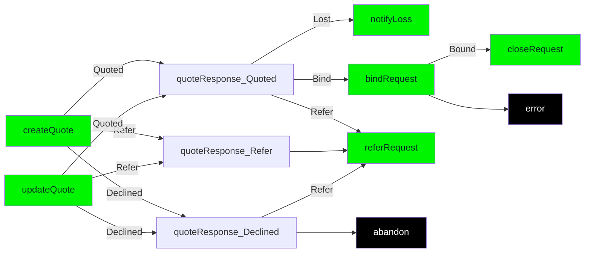
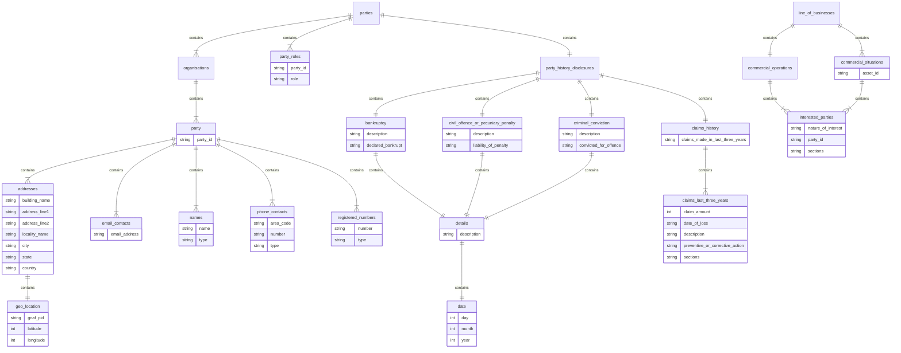

# BAPI IAG Technical Guide

#### Version 0.1

Created by Matt Lightbourn

## Introduction

This page details a concept data payload for the exchange of data between various internal and external parties within the lifecycle of an insurance quote request right through to when that quote is bound and becomes an active policy. It also then includes any alterations, cancellations and renewals of that policy.

# First request based workflow - Create and update quote requests to bind and close
The diagram below shows the various operations required from the initial request of a quote through to binding and closing on the happy path. Where there are other additional requests required to change the outcome (example, **referRequest**) these additional paths will be documented using a variation of this workflow. 

## New Quote Lifecycle Requests

### Create Quote
The beginning of a policy lifecycle starts with the creating of a quote in the context of new business, alteration, cancellation and renewal. The difference will be in whether it is related to an existing `policy` or `quote`. Each new quote is the start of a new **opportunity** along with the first **thread**.
Request Type | Lifecycle Stage | Endpoint | Operation | Operation Type | URL
----|----|----|---|---|---
createQuote | New Business | /quotes | createQuoteForBusinessPackProduct | POST | https://product-services-dev.ff-dev.iagcloud.net/services/v1/product/commercial/business/quotes
createQuote | Alteration | /policies/**{policyId}**/policy-changes | createAlterationForBusinessPackProduct | POST | https://product-services-dev.ff-dev.iagcloud.net/services/v1/product/commercial/business/policies/{policyId}/policy-changes/
createQuote | Cancellation | /policies/**{policyId}**/cancellations/ | createCancellationForBusinessPackProduct | POST | https://product-services-dev.ff-dev.iagcloud.net/services/v1/product/commercial/business/policies/{policyId}/cancellations/

### Update Quote
A requestor can resubmit request based upon a previously submitted quote as an update. This may then impact the insurer response after processing. An updated quote will be received as a response and will now have a new `quote_id` and `quote_number`. Where there are more than one quote in a state of **QUOTED**, either of these can be bound. 
Request Type | Lifecycle Stage | Endpoint | Operation | Operation Type | URL
----|----|----|---|---|---
updateQuote | New Business | /quotes/**{quoteId}** | updateQuoteForBusinessPackProduct | PUT| https://product-services-dev.ff-dev.iagcloud.net/services/v1/product/commercial/business/quotes/{quoteId}
updateQuote | Alteration | /policies/**{policyId}**/policy-changes/**{quoteId}** | updateAlterationForBusinessPackProduct | PUT | https://product-services-dev.ff-dev.iagcloud.net/services/v1/product/commercial/business/policies/{policyId}/policy-changes/{quoteId}/
updateQuote | Cancellation | /policies/**{policyId}**/cancellations/**{quoteId}** | updateCancellationForBusinessPackProduct | PUT | https://product-services-dev.ff-dev.iagcloud.net/services/v1/product/commercial/business/policies/{policyId}/cancellations/{quoteId}/

## Operations based upon Quote Responses

## Bind and Close
If a quote is in a `QUOTED` state then it can be bound and the opportunity closed as long as the quote has not expired.
Request Type | Lifecycle Stage | Endpoint | Operation | Operation Type | URL
----|----|----|---|---|---
bindRequest | QUOTED | /bind-and-issue | bindAndIssueForBusinessPackProduct | POST | https://product-services-dev.ff-dev.iagcloud.net/services/v1/product/commercial/business/bind-and-issue/
closeRequest | BOUND | /close | closeBusinessPackProduct | POST | https://product-services-dev.ff-dev.iagcloud.net/services/v1/product/commercial/business/close/

## Notify Loss

Refer

# Second Request based workflow - Refer and supply additional info to bind and close
These are the steps beyond the first round of workflow where the broker submits a new related request off the back of a response from the insurer. Note, for supply additional information, you will be expecting back a new quoteResponse_...... of some sort. The next steps are articulated in both the first and second round of workflow.


## Additional Operations based upon Second Request based workflow

Conditional
Supply Additional Info

### <a name="documentIdentifiers"></a>Document Identifiers
These are the identifiers that allow you to identify an opportunity, thread, quote and policy.

Object Property | Property Type | Description | Originating Operation
:------ | :-------- | :-------- | :--------------------
`quoteid` | `string` | The quote identifier is used in the url for any update quote operations for new business, alteration and cancel. When a quote requires an update, the `quote_id` from [Policy object](#policyObject) will be required. | `request`
`policyid` | `string` | The policy identifier is used in the url for close after a bind has successfully produced a policy from a quote. When a policy lifecycle needs to close, the `policy_id` from [Policy object](#policyObject) will be required. | `request`
`opportunity_id`
`thread_id`

### <a name="integrationObjects"></a>Integration Related Identifiers
These are the identifiers as used in the **header** and url that control how the interaction between consumer and insurer work.

Object Property | Property Type | Validation | Description | Originating Operation
:------ | :-------- | :-------- | :--- | :--------------------
`X-Iag-Correlation-Id` | `string` | Mandatory | Used to tie together request and response messages for async operations. This is unique per request and returned back in the response. | `request`
`X-B3-GlobalTransactionId` | `string` | Mandatory | This is the unique message identifier for each and every request and response. | `request` `response`

### <a name="messageSenderObject"></a>Message Sender object 

Object Property | Property Type | Validation | Description | Originating Operation
:------ | :-------- | :-------- | :---- | :--------------------
`full_name` | `string` | Mandatory | This is the full name of the system operator that submitted the request or is set to Automated system response if a part of the response. This value should originate from the system user profile. | `request` `response`
`email_address` | `string` | Optional | The email contact details of the system operator. This value should originate from the system user profile. | `request` `response`
```json
  "message_sender": {
    "full_name": "John Smith",
    "email_address": "js@abc.com.au",
    "phone_number" : "03 6073000"
  }
```

### <a name="distributorDetailsObject"></a>Distributor Details object
This contains information about the intermediary organisation transacting with the insurer and includes what trading platform is being used to originate the request.

Object Property | Property Type | Description | Originating Operation
:------ | :-------- | :-------- | :--------------------
`organisation_name` | `string` | This is the broker's organisation name. | `request`
`office_name` | `string` | This is the broker's organisation's branch or site. | `request`
`organisation_identifier` | `string` | This is the broker's organisation code. | `request`
`office_identifier` | `string` | This is the broker's organisation's branch or site code. | `request`
`trading_platform_channel` | `string` | This is the trading platform's channel where the request originated as a data payload. | `request`

```json
  "distributor_details": {
    "trading_platform_channel": "BROKER1_CW"
    "organisation_details": {
      "office": {
        "office_identifier": "Melbourne",
        "office_name": "Melbourne Office"
      },
      "organisation_identifier": "INTERRISK",
      "organisation_name": "Broker One Australia Pty Ltd"
    },
  }
```

# Parties
A party is required for each insured and interested party related to the policy. Each party required a unique identifier (UUID) since it is used as a foreign key in the payload to allocate a `party_role` and assigning the `interested_parties` to the policy and/or specific situations.

In addition to defining the various parties, this is also where `party_history_disclosures` are to be supplied. Where there have been claims within the last three years, for each claim you can supply information.



# Payloads


## Simplified Bind (with Party ABN update)
```json
{
    "opportunity_id" :  "3aacb472-4f44-4385-96c7-f7605707a5ab",
    "thread_id" :  "bcf46dab-2ac0-4797-a0fd-65a040e480c1",
    "quote_id" :  "99a6b43b-7b08-444f-af41-5d337011bcda",
    "message_sender" : {
         "full_name" : "John Smith",
         "email_address" : "js@abc.com.au",
         "phone_number" : "03 6073000"
    },
    "distributor_details" : {
        "trading_platform_channel" : "AON_CW",
        "organisation_details" : {
            "organisation_identifier" : "INTERRISK",
            "organisation_name" :  "Interrisk Australia Pty Ltd)",
            "office" : {
                "office_identifier" : "Melbourne",
                "office_name" : "Melbourne Office",
            }
        }
    },
    "policy_dates" : {
        "message_sent_date" :  "2020-06-30T15:47:55.123+10:00"
    },
    "parties" : {
        "organisations" : [
            {
                "party_id" :  "PRTY123",
                "registered_numbers" : [
                    {
                        "number" :  "123 455 678",
                        "type" : "ABN"
                    }
                ]
            }
        ]
    }
}
```


