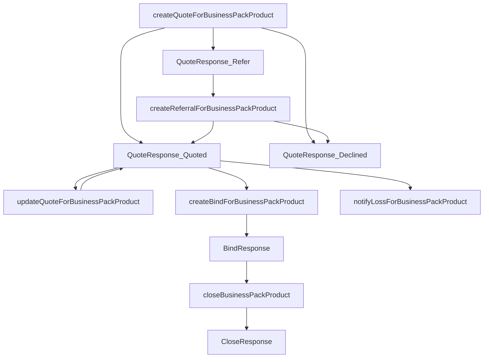
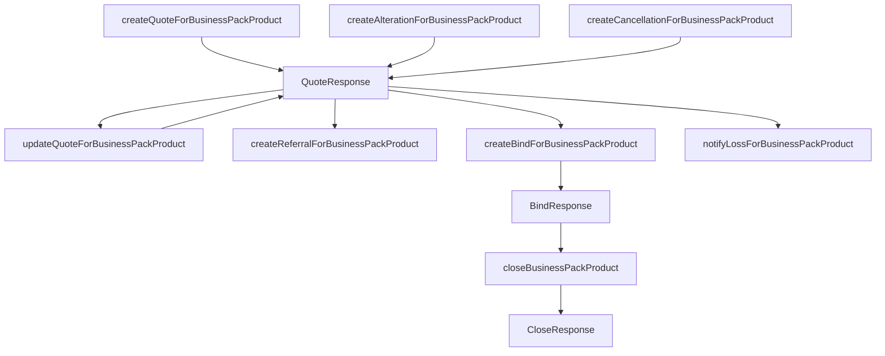
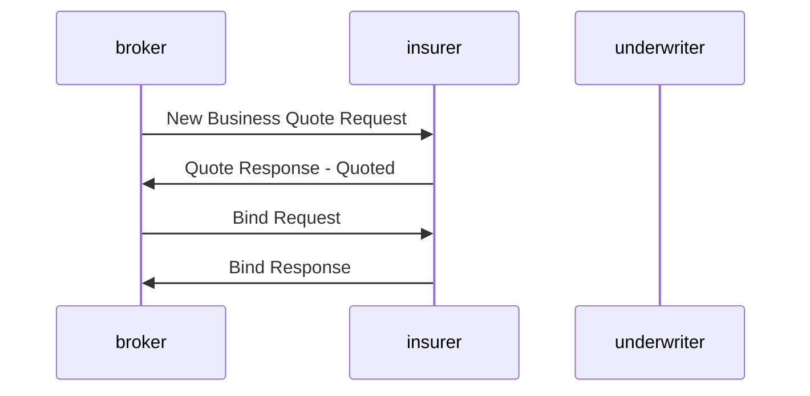
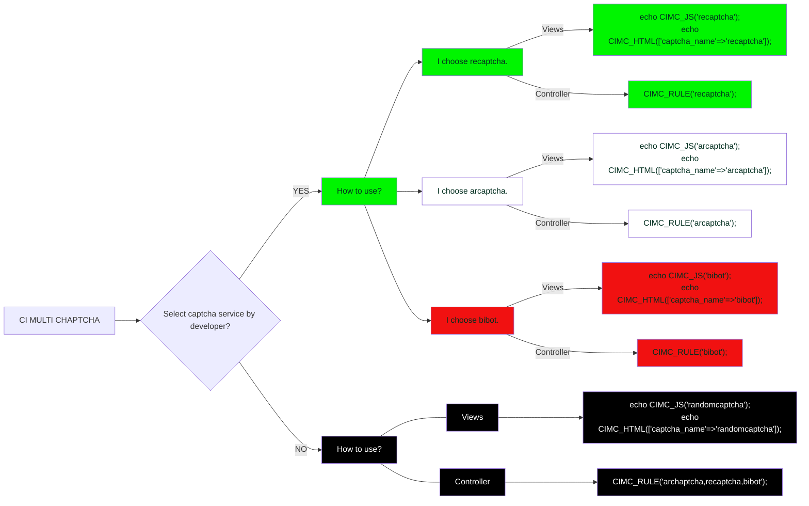

# BAPI IAG Technical Guide

#### Version 0.1

Created by Matt Lightbourn

## Introduction

This page details a concept data payload for the exchange of data between various internal and external parties within the lifecycle of an insurance quote request right through to when that quote is bound and becomes an active policy. It also then includes any alterations, cancellations and renewals of that policy.

### Integration Related Data Objects

These are the identifiers as used in the **header** and url that control how the interaction between consumer and insurer work and in the context of specific quotes or policies.

Object Property | Property Type | Description | Originating Operation
:------ | :-------- | :-------- | :--------------------
`X-Iag-Correlation-Id` | `string` | Used to tie together request and response messages for async operations. This is unique per request and returned back in the response. | `request`
`X-B3-GlobalTransactionId` | `string` | This is the unique message identifier for each and every request and response. | `request` `response`
`quoteid` | `string` | The quote identifier is used in the url for any update quote operations for new business, alteration and cancel. When a quote requires an update, the `quote_id` from [Policy object](#policyObject) will be required. | `request`
`policyid` | `string` | The policy identifier is used in the url for close after a bind has successfully produced a policy from a quote. When a policy lifecycle needs to close, the `policy_id` from [Policy object](#policyObject) will be required. | `request`

### Supported API Operations

The API comes with the below standard operations

Operation | Type | Description
------ | -------- | --------
`QuoteRequest` | `POST` | Create a New Business Quote Request using Quote Request](#quoteRequest)
`UpdateQuote` | `PUT` | Referencing an existing `quoteid` add, remove or change the content of the original quote request.
`BindQuote` | `PUT` | Referencing an existing `quoteid` commit to making a quote into a policy with a bind request.
`CloseCycleRequest` | `PUT` | Once a quote has been a policy, the policy schedule is to be attached the request and referencing the `opportunity_id` in order to complete the request lifecycle.

# Operation based Payloads

## New Business Process

## New Business Process

# Testing Sequence diagram

# Flowchart

