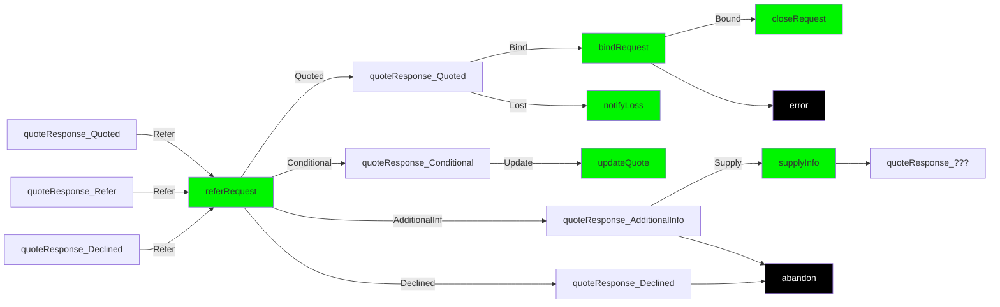
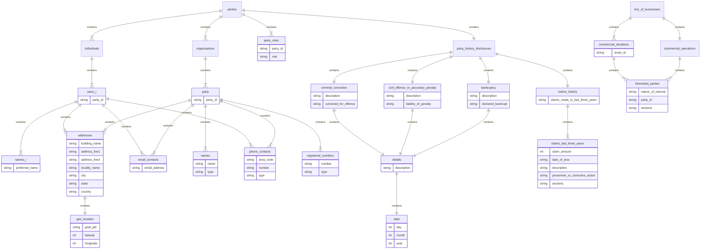
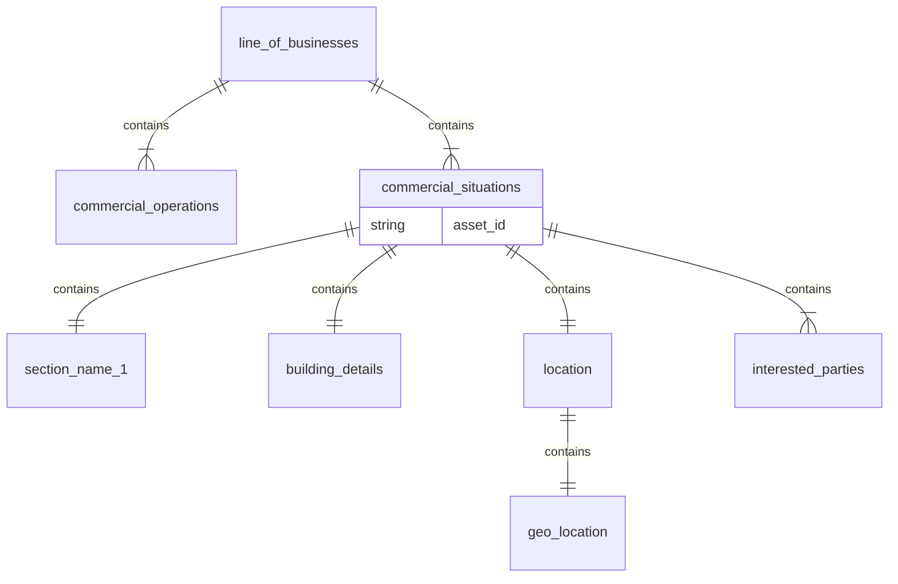
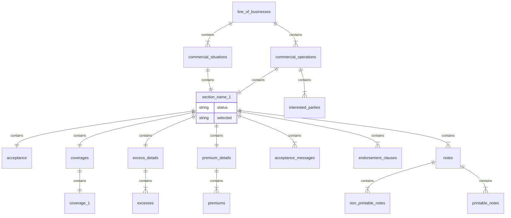

# BAPI IAG Technical Guide

#### Version 0.1

Created by Matt Lightbourn

## Introduction

This page details a concept data payload for the exchange of data between various internal and external parties within the lifecycle of an insurance quote request right through to when that quote is bound and becomes an active policy. It also then includes any alterations, cancellations and renewals of that policy.

# First request based workflow - Create and update quote requests to bind and close
The diagram below shows the various operations required from the initial request of a quote through to binding and closing on the happy path. Where there are other additional requests required to change the outcome (example, **referRequest**) these additional paths will be documented using a variation of this workflow. 

## New Quote Lifecycle Requests

### Create Quote
The beginning of a policy lifecycle starts with the creating of a quote in the context of new business, alteration, cancellation and renewal. The difference will be in whether it is related to an existing `policy` or `quote`. Each new quote is the start of a new **opportunity** along with the first **thread**.
Request Type | Lifecycle Stage | Endpoint | Operation | Operation Type | URL
----|----|----|---|---|---
createQuote | New Business | /quotes | createQuoteForBusinessPackProduct | POST | https://product-services-dev.ff-dev.iagcloud.net/services/v1/product/commercial/business/quotes
createQuote | Alteration | /policies/**{policyId}**/policy-changes | createAlterationForBusinessPackProduct | POST | https://product-services-dev.ff-dev.iagcloud.net/services/v1/product/commercial/business/policies/{policyId}/policy-changes/
createQuote | Cancellation | /policies/**{policyId}**/cancellations/ | createCancellationForBusinessPackProduct | POST | https://product-services-dev.ff-dev.iagcloud.net/services/v1/product/commercial/business/policies/{policyId}/cancellations/

### Update Quote
A requestor can resubmit request based upon a previously submitted quote as an update. This may then impact the insurer response after processing. An updated quote will be received as a response and will now have a new `quote_id` and `quote_number`. Where there are more than one quote in a state of **QUOTED**, either of these can be bound. 
Request Type | Lifecycle Stage | Endpoint | Operation | Operation Type | URL
----|----|----|---|---|---
updateQuote | New Business | /quotes/**{quoteId}** | updateQuoteForBusinessPackProduct | PUT| https://product-services-dev.ff-dev.iagcloud.net/services/v1/product/commercial/business/quotes/{quoteId}
updateQuote | Alteration | /policies/**{policyId}**/policy-changes/**{quoteId}** | updateAlterationForBusinessPackProduct | PUT | https://product-services-dev.ff-dev.iagcloud.net/services/v1/product/commercial/business/policies/{policyId}/policy-changes/{quoteId}/
updateQuote | Cancellation | /policies/**{policyId}**/cancellations/**{quoteId}** | updateCancellationForBusinessPackProduct | PUT | https://product-services-dev.ff-dev.iagcloud.net/services/v1/product/commercial/business/policies/{policyId}/cancellations/{quoteId}/

## Operations based upon Quote Responses

### Bind and Close
If a quote is in a `QUOTED` state then it can be bound and the opportunity closed as long as the quote has not expired.
Request Type | Lifecycle Stage | Endpoint | Operation | Operation Type | URL
----|----|----|---|---|---
bindRequest | QUOTED | /bind-and-issue | bindAndIssueForBusinessPackProduct | POST | https://product-services-dev.ff-dev.iagcloud.net/services/v1/product/commercial/business/bind-and-issue/
closeRequest | BOUND | /close | closeBusinessPackProduct | POST | https://product-services-dev.ff-dev.iagcloud.net/services/v1/product/commercial/business/close/

### Notify Loss
This is to complete the opportunity as lost.
Request Type | Lifecycle Stage | Endpoint | Operation | Operation Type | URL
----|----|----|---|---|---
notifyLoss | QUOTED | /notify-loss | notifyLossForBusinessPackProduct | POST | https://product-services-dev.ff-dev.iagcloud.net/services/v1/product/commercial/business/notify-loss/

### Refer
This is where the broker has decided to refer to an underwriter which can be done where the current state of a request due to the latest response of `QUOTED`, `REFER` or `DECLINED`.
A referral is the same payload as a quote request but includes the following additional values:
Request Type | Lifecycle Stage | Endpoint | Operation | Operation Type | URL
----|----|----|---|---|---
referRequest | any | /referrals | createReferralForBusinessPackProduct | POST | https://product-services-dev.ff-dev.iagcloud.net/services/v1/product/commercial/business/referrals/

# Second Request based workflow - Refer and supply additional info to bind and close
These are the steps beyond the first round of workflow where the broker submits a new related request off the back of a response from the insurer. Note, for supply additional information, you will be expecting back a new quoteResponse_...... of some sort. The next steps are articulated in both the first and second round of workflow.


## Additional Operations based upon Second Request based workflow
### Conditional
A conditional quote requires the broker to update quote as described in first request based workflow. This might be to add or remove specific sections and/or coverages in order to be quoted, for example.

### Supply Additional Info
Request Type | Lifecycle Stage | Endpoint | Operation | Operation Type | URL
----|----|----|---|---|---
supplyInfo | ADDITIONAL INFO | /supply-additional-info | supplyAdditionalInfoForBusinessPackProduct | POST | https://product-services-dev.ff-dev.iagcloud.net/services/v1/product/commercial/business/supply-additional-info/

### Receive Quote Response
As a part of the request from the broker, there is the need to include a [Callback URL](#callbackUrl) which will then receive replies to requests coming from the following operation.
Request Type | Lifecycle Stage | Endpoint | Operation | Operation Type | URL
----|----|----|---|---|---
quoteResponse | reply | /reply | replyForBusinessProduct | POST | https://product-services-dev.ff-dev.iagcloud.net/services/v1/product/commercial/business/reply

# Constructing Quote Request Payload

## Header

### <a name="integrationObjects"></a>Integration Related Identifiers
These are the identifiers as used in the **header** and url that control how the interaction between consumer and insurer work.

Object Property | Property Type | Validation | Description | Originating Operation
:------ | :-------- | :-------- | :--- | :--------------------
`X-Iag-Correlation-Id` | `string` | Mandatory | Used to tie together request and response messages for async operations. This is unique per request and returned back in the response. | `request`
`X-B3-GlobalTransactionId` | `string` | Mandatory | This is the unique message identifier for each and every request and response. | `request` `response`

### <a name="documentIdentifiers"></a>Document Identifiers
These are the identifiers that are required on specific operation where either a quote or policy or both already exist. Example, an update to a quote will require the quoteid supplied in the url.
Object Property | Property Type | Description | Originating Operation
:------ | :-------- | :-------- | :--------------------
`quoteid` | `string` | The quote identifier is used in the url for any update quote operations for new business, alteration and cancel. When a quote requires an update, the `quote_id` from [Policy object](#policyObject) will be required. | `request`
`policyid` | `string` | The policy identifier is used in the url for close after a bind has successfully produced a policy from a quote. When a policy lifecycle needs to close, the `policy_id` from [Policy object](#policyObject) will be required. | `request`

### <a name="callbackUrl"></a>Callback URL
Every request from a broker will need to supply where the insurer should return a reply to using a url.
```json

```

## Body
### <a name="opportunityIdentifiers"></a>Opportunity Identifiers
These are the identifiers that allow you to identify an opportunity and thread. An opportunity can have may threads if a quote is duplicated. An opportunity must be unique at the beginning of the lifecycle for **crerateQuote** otherwise it will be rejected.

Object Property | Property Type | Validation | Description | Originating Operation
:------ | :-------- | :-------- | :----------| :----------
`opportunity_id` | `string` | Mandatory | This is the identifier for the sales opportunity which starts with a create quote. This should be a UUID.| `request` `response`
`thread_id` | `string` | Mandatory | For each opportunity, we support multiple threads to allow for multiple scenarios to be quoted at the same time. All threads will have unique thread identifiers but share the same opportunity identifier. This should be a UUID. | `request` `response`
```json
{
  "opportunity_id": "aeda01d8-f48e-4bb6-a842-ba6e4f85dfe2",
  "thread_id": "c222cecf-af18-455a-9596-e76807d7c9be"
}
```
### <a name="messageSenderObject"></a>Message Sender object 

Object Property | Property Type | Validation | Description | Originating Operation
:------ | :-------- | :-------- | :---- | :--------------------
`full_name` | `string` | Mandatory | This is the full name of the system operator that submitted the request or is set to Automated system response if a part of the response. This value should originate from the system user profile. | `request` `response`
`email_address` | `string` | Optional | The email contact details of the system operator. This value should originate from the system user profile. | `request` `response`
`phone_number` | `string` | Optional | The phone number of the system operator. This value should originate from the system user profile. | `request`
```json
  "message_sender": {
    "full_name": "John Smith",
    "email_address": "js@abc.com.au",
    "phone_number" : "03 6073000"
  }
```
### <a name="distributorDetailsObject"></a>Distributor Details object
This contains information about the intermediary organisation transacting with the insurer and includes what trading platform is being used to originate the request.

Object Property | Property Type | Description | Originating Operation
:------ | :-------- | :-------- | :--------------------
`organisation_name` | `string` | This is the broker's organisation name. | `request`
`office_name` | `string` | This is the broker's organisation's branch or site. | `request`
`organisation_identifier` | `string` | This is the broker's organisation code. | `request`
`office_identifier` | `string` | This is the broker's organisation's branch or site code. | `request`
`trading_platform_channel` | `string` | This is the trading platform's channel where the request originated as a data payload. | `request`

```json
  "distributor_details": {
    "trading_platform_channel": "BROKER1_CW"
    "organisation_details": {
      "office": {
        "office_identifier": "Melbourne",
        "office_name": "Melbourne Office"
      },
      "organisation_identifier": "INTERRISK",
      "organisation_name": "Broker One Australia Pty Ltd"
    },
  }
```
### Policy Dates
All requests will require `message_sent_date` which is in UTC (zulu) and all other values are variable depending on the type of request. As a part of the response, this will also include `quote_expiry_date` which will be in UTC (zulu).
```json
{
    "policy_dates": {
      "message_sent_date": "2020-06-30T15:47:55.123+10:00",
      "term_expiry_date": "2019-08-30",
      "term_inception_date": "2019-08-30",
      "transaction_effective_date": "2019-08-30"
    }
```
### Insured Party
Every request related to a policy requires at least one insured party. Refer to [Insured Parties](#insuredParties)

### Broker Agent or Broker Client
The `distributor_details` identifies where a request is originating. As a part of the correspondence preferences, either a [Broker Agent](#brokerAgent) or [Broker Client](#brokerClient) will be required along with either their email or address.  

### Interested Parties
Where there is the need to include one or more [Interested Party](#interestedParties) in a quote request.

### Business Details
This is information about occupation, turnover, staff and other characteristics of the business. It is contained within [Commercial Operation](#commercialOperation)

### Situations
For each business premises to be added to the policy, there will be a [Situation](#situation) added for each. This includes the physical address, information about the building, security and safety. Refer to the document section Add Situation.

### Sections
There needs to be at least one [Section](#section) in a quote request at policy level or at least one per situation added. A section relates to one or more coverages and each section has their own set of acceptance questions.

### Excesses
There are some [Excesses](#excesses) that the broker can request and then others that are applied by the insurer. In addition to the variable amount, there is also an amount that can be imposed by the underwriter and then the total excess. All excesses are in their respective sections within the request and response.

### Notes
There is the option to add [Notes](#notes) to the policy, situation or section which are either printable in the policy schedule or non-printable in the schedule. 

## Additional Values by type of Transaction
The objects and object properties described above are relevant for New Business, Alteration, Cancellation and (WIP) Renewal. Where there are differences in the type of request, see below.

### Alteration
An alteration to an existing policy requires `policyid` in the header and in the **body** you will be required to include an `alteration_description`. When requesting an alteration, we require all `situations` and `sections` that you are removing to exist in the payload with the addition of a flag.

In this example, the `liability_asset` has had `selected` set the **false** to indicate it has been removed and `total_loss` is set to **true**.
```json
{
  "liability_asset": {
    "selected": false,
    "total_loss": true
  }
}
```
### Cancellation
For a cancellation of an existing policy, the header would include `policyid` and the **body** payload would include the following object and related properties. As per the Swagger contract, all properties are mandatory with exception to `cancellation_description` which is optional. There is reference data for [Cancellation Reasons](#cancellationReasons).
```json
{
  "cancellation": {
    "cancellation_description": "Lorem ipsum dolor sit amet, consectetur",
    "cancellation_effective_date": "2019-09-30",
    "cancellation_reason": {
      "main_reason": "TOTAL LOSS",
      "sub_reason": "SOLD"
    }
  }
```

# Consuming Insurer Response Payloads

## Header

## Body

### Policy Details
Everything that was originally supplied in a request to the insurer is returned in a `policy_details` wrapper in the same structure as the request payload. As a part of the response, there are additional values to be consumed.

### Identifiers and References
All responses will include a new `quote_id` for all requests. In order to process additional operations like **updateQuote** and **bindRequest** for example, you will need the quote_id from here to populate the `quoteid` in the header to meet the requirements of those endpoints. 

Where the request was a **bindRequest** the response will include a `policy_id`. This will be used in the header for any **alterationRequest** where there is an existing policy that you wish to apply changes.

For each `id` there will also be a related `number`. Example, `quote_id` will pair with a `quote_number`.

### Response Values

Object Property | Property Type | Description | Located
:------ | :-------- | :-------- | :--------------------
`remarks` | `object`
`acceptance_messages` | `array object` | This is where automated business rule messages are provided back to the broker | `policy` `situation` `section`
`premiums` | `array object` | This is an object which contains a type of [Premium](#premiums). In the response, you will received 3 objects in the payload for `TRANSACTION`, `ANNUALISED` and `CURRENT_TERM` even if some contain nothing but zeros. | `policy` `section`
`excesses` | `array object` | This is an object which contains each of the [Excesses](#excesses). An excess can be requested by the broker and imposed by the insurer system or underwriter. | `section`
`status` | `string` | This is the [Quote Status](#quoteStatus) of the policy, situation or section. | `policy` `situation` `section`
`endorsement_clauses` | `array object` | These endorsement clauses are either automatically added based upon answers to acceptance questions or occupation. They can also be imposed by an underwriter. There are standard ones which have a code with comsumer specific wording (description) or if an underwriter adds an LE81 then this is a free-text  endorsement clause that has been added. | `policy` `situation` `section`
`transaction_activity_logs` | `array object` | This is an list of all activities to and from the insurer, produced by the insurer system. | `policy`
`referral_details` | `object` | This is where the underwriter response is supplied to the broker. | `policy`

# Response Objects

## <a name="premiums"></a> Premiums
As a part of the response, if QUOTED then it will include 3 premium objects in the `premiums` array at policy level and for each section that has been able to produce a premium.
```json
{
  "premiums": [
     {
        "base_premium": 70,
        "commission": 16.8,
        "commission_gst": 1.68,
        "esl": 5.5,
        "gst": 10,
        "stamp_duty": 15,
        "total_premium": 105.5,
        "type": "TRANSACTION"
     }
  ]
}
```

## <a name="excesses"></a> Excesses
The excess object is generic in nature and has some specific values that describe what type of excess it is and where it originated.
```json
{
"<section name>" : [
  {
     "excess_details": {
        "excesses": [
            {
               "description": "Lorem Ipsum",
               "imposed": 500,
               "total": 500,
               "type": "PROPERTY_DAMAGE_ONLY",
               "unit": "CURRENCY",
               "variable": 500,
               "variable_origin": "BROKER"
            }
     ]
  }
```
## <a name="acceptanceMessages"></a> Acceptance Messages

```json
{    "acceptance_messages": [
      {
        "code": "REF002384B",
        "message": "Sum Insured over threshold limit",
        "recovery": "Reduce Sum Insured amount to below 1,000,000"
      }
    ]
}
```

## <a name="referralDetails"></a> Referral Details

```json
{
    "referral_details" : {
        "attachments" : [
            {
              "category": "POLICY_SCHEDULE",
              "filename": "policy_schedule.pdf"
            }
        ],
        "message" : "Ut enim ad minim veniam, quis nostrud exercitation.",
        "reason" : "DISCLOSURE"
    }
}
```
## <a name="endorsementClauses"></a> Endorsement Clauses

```json
{
  "endorsement_clauses": [
    {
      "code": "LE81",
      "description": "This policy does not cover any liability arising out of or in any way connected with pyrotechnic or fireworks displays or shows, or any use of fireworks or pyrotechnic devices",
      "title": "Fireworks and Pyrotechnic Display Exclusion"
    }
  ]
}
```
## <a name="remarks"></a> Remarks
Remarks can be applied in both directions. From the insurer, `benefits`, `conditions` and `decline`. The `remark` is from the broker to the insurer and is usually at the point where the broker is requesting a referral or is supplying additional information.
```json
{
  "remarks": {
    "benefits": [
      {
        "benefit": "Lorem ipsum dolor sit amet, consectetur adipiscing elit, sed do eiusmod."
      }
    ],
    "conditions": [
      {
        "condition": "Lorem ipsum dolor sit amet, consectetur adipiscing elit, sed do eiusmod."
      }
    ],
    "decline": {
      "description": "Lorem ipsum dolor sit amet, consectetur adipiscing elit, sed do eiusmod."
    },
    "remark": {
      "attachments": [
        {
          "category": "POLICY_SCHEDULE",
          "filename": "policy_schedule.pdf"
        }
      ],
      "description": "Lorem Ipsum",
      "message": "Ut enim ad minim veniam, quis nostrud exercitation.",
      "reason": "DISCLOSURE"
    }
  }
}
```
## <a name="transactionActivityLog"></a> Transaction Activity Log

```json
{
  "transaction_activity_logs": [
    {
      "acceptance_messages": "REF00002 Transaction forward-dated beyond standard limit",
      "attachments": "Schedule.pdf (1mb)\nPhoto.jpg (150kb)\nEmail.msg (1mb)",
      "reference": "E15T1234567",
      "remarks": "This quote is based on CGU’s default excess.",
      "sender_name": "John Smith",
      "sender_organisation": "CGU",
      "serial_number": 1,
      "time_stamp": "2020-06-30T15:47:55.123+10:00",
      "type": "Initial Quote"
    }
  ]
}
```
# Parties
A party is required for each insured and interested party related to the policy. Each party required a unique identifier (UUID) since it is used as a foreign key in the payload to allocate a `party_role` and assigning the `interested_parties` to the policy and/or specific situations.

In addition to defining the various parties, this is also where `party_history_disclosures` are to be supplied. Where there have been claims within the last three years, for each claim you can supply information.

## <a name="insuredParties"></a> Insured Parties
These are the named parties that are to be insured by the policy.

### Party Primary Policy Holder

```json
{
"parties" : {
     "organisations": [ 
       {
         "addresses": [
           {
              "address_line_1": "181 William Street",
              "address_line_2": "Melbourne 2000",
              "building_name": "Tower Two",
              "country": "AUS",
              "geo_location": {
                 "gnaf_pid": "GANSW716798454",
                 "latitude": -31.7708963,
                 "longitude": 115.84100663
              },
              "locality_name": "Lane Cove",
              "postcode": "3000",
              "state": "VIC"
           }
        ],
        "email_contacts": {
          "emails": [
            {
              "email_address": "abc@xyz.com"
            }
          ]
        },
        "insured": {
          "broker_client_id": "CLNT1234567890",
          "insurer_client_id": "CLNT1234567890"
        },
        "names": [
          {
            "name": "Business Name Limited.",
            "type": "TRADING"
          },
          {
            "name": "The Name to Insure Under",
            "type": "REGISTERED"
          }
        ],
        "party_id": "insured_party_uuid",
        "phone_contacts": {
          "phone_numbers": [
            {
              "area_code": "03",
              "number": "96024650",
              "type": "PRIMARY"
            }
          ]
        },
       "registered_numbers": [
          {
            "number": "123 455 678",
            "type": "ABN"
          }
        ]
     }
   ]
  }
}
```
### Party Role - Primary Policy Holder
In order to use this party as insured, there is the need to assign a party role to the payload using the `party_id` as shown above (**INSURED1**) which should be a UUID. Reference data for [Party Roles](#partyRoles)
```json
  {
      "party_roles": [
        {
          "party_id": "INSURED1",
          "role": "PRIMARY_POLICY_HOLDER"
        }
      ]
    }
```
## Correspondence Preferences
If the correspondence preference is **broker agent**, then the party can contain any of the following information with a minimum of `party_id`, `email_address` and/or `address` depending on whether `preferred_communication_mode is "EMAIL" or "MAIL". 

```json
{
  "correspondence_preference": {
    "party_id": "BROKER1",
    "preferred_communication_mode": "EMAIL"
  }
}
```

## <a name="brokerAgent"></a> Party - Broker Agent
Payload for a broker agent.
```json
  {
    "parties": {
      "individuals": [
        {
          "addresses": [
            {
              "address_line_1": "181 William Street",
              "address_line_2": "Melbourne 2000",
              "building_name": "Tower Two",
              "country": "AUS",
              "locality_name": "Lane Cove",
              "postcode": "3000",
              "state": "VIC"
            }
          ],
          "email_contacts": {
            "emails": [
              {
                "email_address": "abc@xyz.com"
              }
            ]
          },
          "party_id": "BROKER1",
          "phone_contacts": {
            "phone_numbers": [
              {
                "area_code": "03",
                "number": "96024650",
                "type": "PRIMARY"
              }
            ]
          }
        }
      ]
    }
  }
```
### Party Role - Broker Agent
In order to use this party as broker agent, there is the need to assign a party role to the payload using the `party_id` as shown above (**BROKER1**) which should be a UUID. Reference data for [Party Roles](#partyRoles)
```json
  {
      "party_roles": [
        {
          "party_id": "BROKER1",
          "role": "BROKER_AGENT"
        }
      ]
    }
```
## <a name="brokerClient"></a> Party - Broker Client
Payload for a broker client.
```json
  {
    "parties": {
      "individuals": [
        {
          "addresses": [
            {
              "address_line_1": "181 William Street",
              "address_line_2": "Melbourne 2000",
              "building_name": "Tower Two",
              "country": "AUS",
              "locality_name": "Lane Cove",
              "postcode": "3000",
              "state": "VIC"
            }
          ],
          "email_contacts": {
            "emails": [
              {
                "email_address": "abc@xyz.com"
              }
            ]
          },
          "names" : {
            "details" : [
              {
                "title" : "MR"
              }],
              "preferred_name" : "John Smith"
          },
          "party_id": "CLIENT1",
          "phone_contacts": {
            "phone_numbers": [
              {
                "area_code": "03",
                "number": "96024650",
                "type": "PRIMARY"
              }
            ]
          }
        }
      ]
    }
  }
```
### Party Role - Broker Client
In order to use this party as broker client, there is the need to assign a party role to the payload using the `party_id` as shown above (**CLIENT1**) which should be a UUID. Reference data for [Party Roles](#partyRoles)
```json
  {
      "party_roles": [
        {
          "party_id": "CLIENT1",
          "role": "BROKER_CLIENT"
        }
      ]
    }
```
## <a name="interestedParties"></a> Party - Interested Party
If a Quote request and subsequent policy include the addition of interested parties, they are to be added as a party as shown below.
```json
{
"parties" : {
     "organisations": [
       {
         "addresses": [
           {
              "address_line_1": "181 William Street",
              "address_line_2": "Melbourne 2000",
              "building_name": "Tower Two",
              "country": "AUS",
              "geo_location": {
                 "gnaf_pid": "GANSW716798454",
                 "latitude": -31.7708963,
                 "longitude": 115.84100663
              },
              "locality_name": "Lane Cove",
              "postcode": "3000",
              "state": "VIC"
           }
        ],
        "email_contacts": {
           "emails": [
             {
               "email_address": "abc@abcbankplc.com"
             }
           ]
        },
        "names": [
          {
            "name": "ABC Bank plc",
            "type": "TRADING"
          }
        ],
        "party_id": "INTEREST1",
        "phone_contacts": {
           "phone_numbers": [
             {
               "area_code": "03",
               "number": "96024650",
               "type": "PRIMARY"
             }
           ]
         }
       }
      ]
    }
  }
```
### Party Role - Interested Party
In order to use this party as broker client, there is the need to assign a party role to the payload using the `party_id` as shown above (**INTEREST1**) which should be a UUID. Reference data for [Party Roles](#partyRoles)
```json
  {
      "party_roles": [
        {
          "party_id": "INTEREST1",
          "role": "INTERESTED_PARTY"
        }
      ]
    }
```
### Assigning Interested Party - Policy Level
Using the `party_id` of each interested party, where policy level sections exist, assign them a `nature_of_interest` and list the `sections` as per the accepted reference data options. [Nature of Interest](#natureOfInterest) and [Interested Party Sections](#interestedPartyections)
```json
"commercial_operations" : [
    {
      "interested_parties": [
        {
          "nature_of_interest": "MORTGAGEE",
          "party_id": "INTEREST1",
          "sections": ["BUSINESS_INTERRUPTION","PUBLIC_LIABILITY"]
        }
     ],
   }]
```
### Assigning Interested Party - Situation Level
Using the `party_id` of each interested party, where situation level sections exist, assign them a `nature_of_interest` and list the `sections` as per the accepted reference data options for each situation applicable. [Nature of Interest](#natureOfInterest) and [Sections](#sections).
```json
"commercial_situations" : [
    {
      "interested_parties": [
        {
          "nature_of_interest": "MORTGAGEE",
          "party_id": "INTEREST1",
          "sections": ["BUSINESS_PROPERTY","ELECTRONIC_EQUIPMENT"]
        }
     ],
   }]
```
## Party Disclosures

### <a name="claimsHistory"></a>Claims History
If `claims_made_in_last_three_years` = true, then for each claim, this is the information to be produced.
```json
{
    "party_history_disclosures": {
      "claims_history": {
        "claims_last_three_years": [
          {
            "claim_amount": 200,
            "date_of_loss": {
              "day": 15,
              "month": 6,
              "year": 2020
            },
            "description": "Business Claim",
            "preventive_or_corrective_action": "updated reports",
            "sections": [
              "string"
            ]
          }
        ],
        "claims_made_in_last_three_years": true
      }
    }
}
```
Object Property | Property Type | Validation | Description | Originating Operation
:------ | :-------- | :-------- | :--------- | :-----------
`claim_amount` | `integer` | Mandatory | The total value of the claim. | `request`
`date_of_loss.day` | `integer` | Optional | The day of the date when the loss occurred. | `request`
`date_of_loss.month` | `integer` | Mandatory | The month of the date when the loss occurred. | `request`
`date_of_loss.year` | `integer` | Mandatory | The year of the date when the loss occurred. | `request`
`description` | `string` | Mandatory | Description of what happened | `request`
`preventive_or_corrective_action` | `string` | Optional | What actions were taken to prevent this happening in the future. | `request`
`sections[]` | `array string` | Mandatory | The claim is related to these [Sections](#sections). | `request`

### <a name="partyDisclosures"></a>Party Disclosures
The party disclosures are very explicit for all relevant disclosures required for all quote requests.
```json
{
    "party_history_disclosures": {
      "bankruptcy": {
        "declared_bankrupt": "YES",
        "details": [
          {
            "date": {
              "day": 15,
              "month": 6,
              "year": 2020
            },
            "description": "Details of the disclosure."
          }
        ]
      },
      "civil_offence_or_pecuniary_penalty": {
        "details": [
          {
            "date": {
              "day": 15,
              "month": 6,
              "year": 2020
            },
            "description": "Details of the disclosure."
          }
        ],
        "liable_for_penalty": "YES"
      },
      "criminal_conviction": {
        "convicted_for_offence": "YES",
        "details": [
          {
            "date": {
              "day": 15,
              "month": 6,
              "year": 2020
            },
            "description": "Details of the disclosure."
          }
        ]
      },
      "exceptional_risk_circumstances": {
        "details": [
          {
            "date": {
              "day": 15,
              "month": 6,
              "year": 2020
            },
            "description": "Details of the disclosure."
          }
        ],
        "risk_exist": "YES"
      },
      "holding_underwriter": {
        "current_liability_or_insurance": "YES",
        "name": "Allianz",
        "new_venture": "NO",
        "other": "Other"
      },
      "insolvency": {
        "details": [
          {
            "date": {
              "day": 15,
              "month": 6,
              "year": 2020
            },
            "description": "Details of the disclosure."
          }
        ],
        "insolvency_exist": "YES"
      },
      "insurance_declined_cancelled_terms_imposed": {
        "details": [
          {
            "date": {
              "day": 15,
              "month": 6,
              "year": 2020
            },
            "description": "Details of the disclosure."
          }
        ],
        "insurance_declined": "YES"
      },
      "property_in_disrepair_or_poor_condition": {
        "condition_exist": "YES",
        "details": [
          {
            "description": "Property in Disrepair or Poor Condition."
          }
        ]
      },
      "threats_to_life_or_property_received": {
        "details": [
          {
            "date": {
              "day": 15,
              "month": 6,
              "year": 2020
            },
            "description": "Details of the disclosure."
          }
        ],
        "threats_received": "YES"
      }
    }
    }
```
# <a name="situation"></a>Situation
Below is the structure of a situation which contains information about the location and building. Each situation has its own `asset_id` which must be unique within a payload from any other situations in the payload. For each situation where there is an `interested_party` there is an array for adding the object as previously detailed as a part of **Parties**.

In addition, a situation then has many sections which in turn have various coverages, etc as covered in the next section.

### <a name="commercialSituation"></a>Commercial Situation
The following example shows a single situation.
```json
{
    "line_of_businesses": [
      {
        "asset_groups": {
          "commercial_situations": [
            {
              "acceptance_messages": [
                {
                  "code": "REF002384B",
                  "message": "Sum Insured over threshold limit",
                  "recovery": "Reduce Sum Insured amount to below 1,000,000"
                }
              ],
              "asset_id": "d222cecf-af58-465a-9506-e76807d7d9tf",
              "building_details": {
                "combustible_material_located_at_premises": {
                  "lower_limit": 10,
                  "upper_limit": 20
                },
                "floor_material": "WOOD_OR_TIMBER",
                "no_of_storeys": 2,
                "roof_material": "CONCRETE",
                "wall_material": "BRICK_OR_STONE",
                "year_constructed": {
                  "lower_limit": 2000,
                  "upper_limit": 2001
                },
                "year_last_rewired": {
                  "lower_limit": 2000,
                  "upper_limit": 2001
                }
              },
              "endorsement_clauses": [
                {
                  "code": "LE81",
                  "description": "This policy does not cover any liability arising out of or in any way connected with pyrotechnic or fireworks displays or shows, or any use of fireworks or pyrotechnic devices",
                  "title": "Fireworks and Pyrotechnic Display Exclusion"
                }
              ],
              "interested_parties": [
                {
                  "nature_of_interest": "First Mortgage",
                  "party_id": "CLNT1234567890",
                  "sections": "[{PROPERTY},{LIABILITY}]"
                }
              ],
              "location": {
                "address_line_1": "181 William Street",
                "address_line_2": "Melbourne 2000",
                "building_name": "Tower Two",
                "country": "AUS",
                "geo_location": {
                  "gnaf_pid": "GANSW716798454",
                  "latitude": -31.7708963,
                  "longitude": 115.84100663
                },
                "locality_name": "Lane Cove",
                "postcode": "3000",
                "state": "VIC"
              },
              "occupation": {
                "consumer_occupation_code": "4511",
                "consumer_occupation_description": "4511",
                "non_business_related_activities": "4511",
                "non_business_related_activities_engaged": "NO",
                "underwriter_occupation_code": "4511",
                "underwriter_occupation_description": "Executive"
              },
              "premises_location": "MAIN_OR_SUBURBAN_STREET",

// sections insert here //

"risk_mitigation": {
                "fire_protection": {
                  "fire_alarms": {
                    "installed": "YES",
                    "monitored": "YES"
                  },
                  "fire_blankets": "YES",
                  "fire_extinguishers": "YES",
                  "fire_sprinkler_type": {
                    "confirms_to_australian_standard": "YES",
                    "hundred_percentage_coverage": "YES",
                    "water_supply_sprinkler": "DUAL"
                  },
                  "fire_sprinklers_engaged": "YES",
                  "heat_detectors": {
                    "installed": "YES",
                    "monitored": "YES"
                  },
                  "hose_reels": "YES",
                  "premises_connected_to_town_water": "YES",
                  "smoke_detectors": {
                    "installed": "YES",
                    "monitored": "YES"
                  }
                },
                "security_protection": {
                  "electronic": {
                    "burglar_alarm": "NO_ALARM",
                    "electronic_access_on_external_doors": "YES",
                    "monitored_base_alarm_type": "CLASS_2_DIGITAL_DIALLER_AND_GSM",
                    "monitored_cctv": "YES"
                  },
                  "physical": {
                    "bollards": "YES",
                    "external_lighting": "YES",
                    "ground_level_windows": "ALL_LOCKS_OR_BARS_OR_GRILLES_INCL_FIXED_PLATES",
                    "locks_on_external_doors": "YES_MAYBE",
                    "roller_shutters": "YES",
                    "security_fencing_full_perimeter": "YES",
                    "watchman_patrols": "YES"
                  }
                }
              },
              "selected": true,
              "status": "QUOTED",
              "tenants": [
                {
                  "occupation": {
                    "consumer_occupation_code": "4511",
                    "consumer_occupation_description": "4511",
                    "underwriter_occupation_code": "4511",
                    "underwriter_occupation_description": "Executive"
                  },
                  "occupied_floor_space_percentage": 20
                }
              ]
            }
          ]
        }
```
### <a name="commercialOperation"></a>Commercial Operation
This is where we place what we refer to as `policy` level sections into. If there are no sections to add (for example, the quote request is for a `situation` level section only, like PROPERTY) then some of commercial_operation will still exist because it contains the **business details** as required to give details on turnover, staff numbers, etc.
```json
{
        "assets": {
          "commercial_operations": [
            {
              "business_established_year": 2014,
              "interested_parties": [
                {
                  "nature_of_interest": "First Mortgage",
                  "party_id": "CLNT1234567890",
                  "sections": "[{PROPERTY},{LIABILITY}]"
                }
              ],

// insert sections here //

              "location": {
                "address_line_1": "181 William Street",
                "address_line_2": "Melbourne 2000",
                "building_name": "Tower Two",
                "country": "AUS",
                "geo_location": {
                  "gnaf_pid": "GANSW716798454",
                  "latitude": -31.7708963,
                  "longitude": 115.84100663
                },
                "locality_name": "Lane Cove",
                "postcode": "3000",
                "state": "VIC"
              },
              "occupation": {
                "consumer_occupation_code": "4511",
                "consumer_occupation_description": "4511",
                "non_business_related_activities": "4511",
                "non_business_related_activities_engaged": "NO",
                "underwriter_occupation_code": "4511",
                "underwriter_occupation_description": "Executive"
              },
              "recycling_activities": {
                "recycled_products_engaged": "YES"
              },
              "restricted_products": {
                "description": "store gunpowder.",
                "explosive_products_engaged": "YES"
              },
              "staff_details": [
                {
                  "number": 20,
                  "type": "FULL_TIME"
                }
              ],
              "storage_of_flammable_goods": {
                "flammable_dangerous_hazardous_goods_engaged": "YES",
                "quantity": {
                  "lower_limit": 10,
                  "upper_limit": 20
                },
                "storage_goods_cabinets": "YES",
                "storage_regulations_compliance": "YES"
              },
              "total_annual_turnover": 1000000,
              "turnover_breakdown_percentage": {
                "act": 10,
                "nsw": 20,
                "nt": 10,
                "qld": 10,
                "sa": 10,
                "tas": 10,
                "vic": 20,
                "wa": 10
              }
            }
          ]
        }
      }
```

# <a name="section"></a>Section
Each section is explicitly named in the payload and can originate from either `commercial_operations` (for sections like LIABILITY) and `commercial_situations` for sections like PROPERTY).

Each section has its own set of explicitly named coverages which have a variable number of common coverage properties. A coverage in this model represents covers, cover extensions and additional benefits together.

The diagram below represents both request and response properties together. The properties that are not submitted in a request are `acceptance_messages`, `premium_details`, `endorsement_clauses` along with the `status`.

### <a name="sectionLiability"></a>Section - Liability
This gives examples of `acceptance` questions, `coverages`, `excesses`, `endorsement_clauses`, `acceptance_messages`. The validation requirements for acceptance questions and sub questions are detailed in the Swagger contract.
```json
{
              "liability_asset": {
                "acceptance": {
                  "contractors_and_subcontractors": {
                    "contractors_and_subcontractors_engaged": "YES",
                    "own_liability_and_workers_compensation_insurance": "YES",
                    "pay_estimate_over_next_twelve_months": [
                      {
                        "amount": 1000000,
                        "contract_type": "LABOUR_ONLY"
                      }
                    ],
                    "types_of_work_contractors_performed": "Delivery"
                  },
                  "hazardous_activities": {
                    "hotwork": {
                      "details": "Welding of car doors",
                      "hotwork_engaged": "YES"
                    },
                    "working_at_height": {
                      "lower_limit": 10,
                      "upper_limit": 20
                    }
                  }
                },
                "acceptance_messages": [
                  {
                    "code": "REF002384B",
                    "message": "Sum Insured over threshold limit",
                    "recovery": "Reduce Sum Insured amount to below 1,000,000"
                  }
                ],
                "coverages": {
                  "designated_contracts": {
                    "description": "Lorem Ipsum"
                  },
                  "motor_trades": {
                    "rectification_of_faulty_workmanship": {
                      "estimated_turnover_next_twelve_months": 100000,
                      "rectification_coverage_required": true
                    },
                    "vehicle_inspection_and_valuation": {
                      "total_fee_income_next_twelve_months": 100000,
                      "vehicle_inspection_coverage_required": true
                    },
                    "vehicles_or_watercraft_in_control": {
                      "cover_type": "INCLUDING_TESTING_AND_DELIVERY",
                      "estimated_maximum_value": 350000
                    }
                  },
                  "property_in_physical_and_legal_control": {
                    "sum_insured": 100000
                  }
                },
                "endorsement_clauses": [
                  {
                    "code": "LE81",
                    "description": "This policy does not cover any liability arising out of or in any way connected with pyrotechnic or fireworks displays or shows, or any use of fireworks or pyrotechnic devices",
                    "title": "Fireworks and Pyrotechnic Display Exclusion"
                  }
                ],
                "excess_details": {
                  "excesses": [
                    {
                      "description": "Lorem Ipsum",
                      "imposed": 500,
                      "total": 500,
                      "type": "PROPERTY_DAMAGE",
                      "unit": "DAYS",
                      "variable": 500,
                      "variable_origin": "BROKER"
                    }
                  ]
                },
                "notes": {
                  "non_printable_notes": [
                    {
                      "description": "Description",
                      "note": "Lorem ipsum dolor sit amet, consectetur adipiscing",
                      "note_id": "512fd3a5-529a-4659-b483-6b0aba1a27a5"
                    }
                  ],
                  "printable_notes": [
                    {
                      "description": "Description",
                      "note": "Lorem ipsum dolor sit amet, consectetur adipiscing",
                      "note_id": "512fd3a5-529a-4659-b483-6b0aba1a27a5"
                    }
                  ]
                },
                "premium_details": {
                  "premiums": [
                    {
                      "base_premium": 70,
                      "commission": 16.8,
                      "commission_gst": 1.68,
                      "esl": 5.5,
                      "gst": 10,
                      "stamp_duty": 15,
                      "total_premium": 105.5,
                      "type": "TRANSACTION"
                    }
                  ]
                },
                "selected": true,
                "status": "QUOTED",
                "total_loss": true
              }
}
```
## <a name="notes"></a>Notes
Below is an example of both printable and non-printable notes. Printable notes are ones that will be added to the policy schedule.
```json
{
                "notes": {
                  "non_printable_notes": [
                    {
                      "description": "Description",
                      "note": "Lorem ipsum dolor sit amet, consectetur adipiscing",
                      "note_id": "512fd3a5-529a-4659-b483-6b0aba1a27a5"
                    }
                  ],
                  "printable_notes": [
                    {
                      "description": "Description",
                      "note": "Lorem ipsum dolor sit amet, consectetur adipiscing",
                      "note_id": "512fd3a5-529a-4659-b483-6b0aba1a27a5"
                    }
                  ]
                }
}
```

# Reference Data

### <a name="partyRoles"></a>Party Roles
| Party Role |
:----
| PRIMARY_POLICY_HOLDER |
| INTERESTED_PARTY |
| BROKER_AGENT |
| BROKER_CLIENT |

### <a name="natureOfInterest"></a>Nature of Interest
| Nature of Interest |
:----
| MORTGAGEE |
| LOCAL_GOVERNMENT_AUTHORITY |
| LANDLORD |
| LEASE |
| PREMIUM_FUNDER |
| PRINCIPAL |
| FRANCHISOR |
| LENDOR |
| OTHER |

### <a name="sections"></a>Sections
| Interested Party Section |
:----
| PUBLIC_AND_PRODUCTS_LIABILITY |
| GENERAL_PROPERTY |
| EMPLOYEE_DISHONESTY |
| TAX_INVESTIGATION |

### <a name="quoteStatus"></a>Quote Status
Quote status is located at various locations in the payload as shown below:

| Quote STATUS |
:----
| QUOTED |
| DECLINED |
| REFER |
| REFERRED |
| INFORMATION_REQUESTED |
| INFORMATION_SUPPLIED |
| BOUND |
| CLOSED |

# Payload Examples

## Quote Request - All

## Quote Request - additions specific to alteration

## Quote Request - additions specific to cancellation

## Refer Quote Request - additions specific to referrals and supply information

## Bind Request

### Bind with no update to insured party ABN details
```json
{
    "opportunity_id" :  "3aacb472-4f44-4385-96c7-f7605707a5ab",
    "thread_id" :  "bcf46dab-2ac0-4797-a0fd-65a040e480c1",
    "quote_id" :  "99a6b43b-7b08-444f-af41-5d337011bcda",
    "message_sender" : {
         "full_name" : "John Smith",
         "email_address" : "js@abc.com.au",
         "phone_number" : "03 6073000"
    },
    "distributor_details" : {
        "trading_platform_channel" : "AON_CW",
        "organisation_details" : {
            "organisation_identifier" : "INTERRISK",
            "organisation_name" :  "Interrisk Australia Pty Ltd)",
            "office" : {
                "office_identifier" : "Melbourne",
                "office_name" : "Melbourne Office",
            }
        }
    },
    "policy_dates" : {
        "message_sent_date" :  "2020-06-30T15:47:55.123+10:00"
    }
}
```
### Bind with ABN update for insured parties
```json
{
    "opportunity_id" :  "3aacb472-4f44-4385-96c7-f7605707a5ab",
    "thread_id" :  "bcf46dab-2ac0-4797-a0fd-65a040e480c1",
    "quote_id" :  "99a6b43b-7b08-444f-af41-5d337011bcda",
    "message_sender" : {
         "full_name" : "John Smith",
         "email_address" : "js@abc.com.au",
         "phone_number" : "03 6073000"
    },
    "distributor_details" : {
        "trading_platform_channel" : "AON_CW",
        "organisation_details" : {
            "organisation_identifier" : "INTERRISK",
            "organisation_name" :  "Interrisk Australia Pty Ltd)",
            "office" : {
                "office_identifier" : "Melbourne",
                "office_name" : "Melbourne Office",
            }
        }
    },
    "policy_dates" : {
        "message_sent_date" :  "2020-06-30T15:47:55.123+10:00"
    },
    "parties" : {
        "organisations" : [
            {
                "party_id" :  "PRTY123",
                "registered_numbers" : [
                    {
                        "number" :  "123 455 678",
                        "type" : "ABN"
                    }
                ]
            }
        ]
    }
}
```
## Close Request

## Notify Loss

