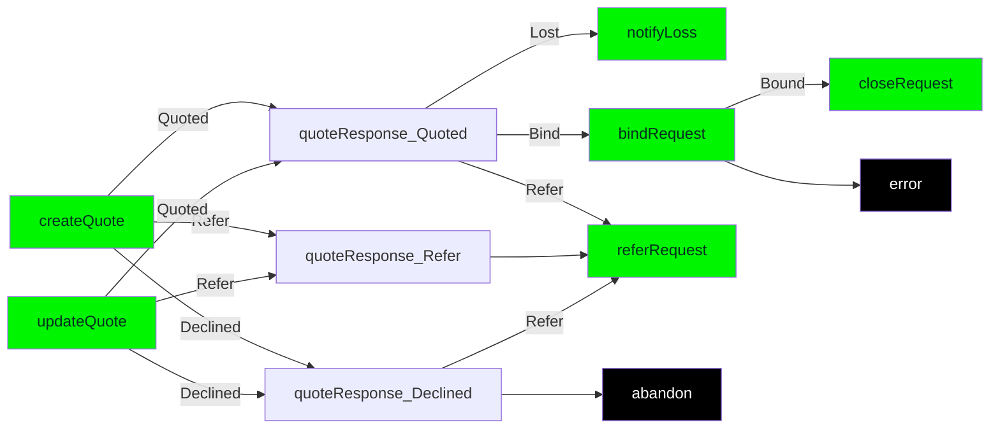

# BAPI IAG Technical Guide

#### Version 0.1

Created by Matt Lightbourn

## Introduction

This page details a concept data payload for the exchange of data between various internal and external parties within the lifecycle of an insurance quote request right through to when that quote is bound and becomes an active policy. It also then includes any alterations, cancellations and renewals of that policy.

# First round - Workflow from Quote to an Insurer Decision
The diagram below shows the various operations required from the initial request of a quote through to binding and closing on the happy path. Where there are other additional requests required to change the outcome (example, **referRequest**) these additional paths will be documented using a variation of this workflow. 

## Create Quote
The beginning of a policy lifecycle starts with the creating of a quote in the context of new business, alteration, cancellation and renewal. The difference will be in whether it is related to an existing `policy` or `quote`. Each new quote is the start of a new **opportunity** along with the first **thread**.
Request Type | Lifecycle Stage | Endpoint | Operation | Operation Type | URL
----|----|----|---|---|---
createQuote | New Business | /quotes | createQuoteForBusinessPackProduct | POST | https://product-services-dev.ff-dev.iagcloud.net/services/v1/product/commercial/business/quotes
createQuote | Alteration | /policies/**{policyId}**/policy-changes | createAlterationForBusinessPackProduct | POST | https://product-services-dev.ff-dev.iagcloud.net/services/v1/product/commercial/business/policies/{policyId}/policy-changes/
createQuote | Cancellation | /policies/**{policyId}**/cancellations/ | createCancellationForBusinessPackProduct | POST | https://product-services-dev.ff-dev.iagcloud.net/services/v1/product/commercial/business/policies/{policyId}/cancellations/

## Update Quote
Request Type | Lifecycle Stage | Endpoint | Operation | Operation Type | URL
----|----|----|---|---|---
updateQuote | New Business | /quotes/**{quoteId}** | updateQuoteForBusinessPackProduct | PUT| https://product-services-dev.ff-dev.iagcloud.net/services/v1/product/commercial/business/quotes/{quoteId}
updateQuote | Alteration | /policies/**{policyId}**/policy-changes/**{quoteId}** | updateAlterationForBusinessPackProduct | PUT | https://product-services-dev.ff-dev.iagcloud.net/services/v1/product/commercial/business/policies/{policyId}/policy-changes/{quoteId}/
updateQuote | Cancellation | /policies/**{policyId}**/cancellations/**{quoteId}** | updateCancellationForBusinessPackProduct | PUT | https://product-services-dev.ff-dev.iagcloud.net/services/v1/product/commercial/business/policies/{policyId}/cancellations/{quoteId}/

### Document Identifiers
These are the identifiers that allow you to identify an opportunity, thread, quote and policy.

Object Property | Property Type | Description | Originating Operation
:------ | :-------- | :-------- | :--------------------
`quoteid` | `string` | The quote identifier is used in the url for any update quote operations for new business, alteration and cancel. When a quote requires an update, the `quote_id` from [Policy object](#policyObject) will be required. | `request`
`policyid` | `string` | The policy identifier is used in the url for close after a bind has successfully produced a policy from a quote. When a policy lifecycle needs to close, the `policy_id` from [Policy object](#policyObject) will be required. | `request`
`opportunity_id`
`thread_id`

### Integration Related Identifiers
These are the identifiers as used in the **header** and url that control how the interaction between consumer and insurer work.

Object Property | Property Type | Description | Originating Operation
:------ | :-------- | :-------- | :--------------------
`X-Iag-Correlation-Id` | `string` | Used to tie together request and response messages for async operations. This is unique per request and returned back in the response. | `request`
`X-B3-GlobalTransactionId` | `string` | This is the unique message identifier for each and every request and response. | `request` `response`

# Parties
A party is required for each insured and interested party related to the policy. Each party required a unique identifier (UUID) since it is used as a foreign key in the payload to allocate a `party_role` and assigning the `interested_parties` to the policy and/or specific situations.

In addition to defining the various parties, this is also where `party_history_disclosures` are to be supplied. Where there have been claims within the last three years, for each claim you can supply information.

