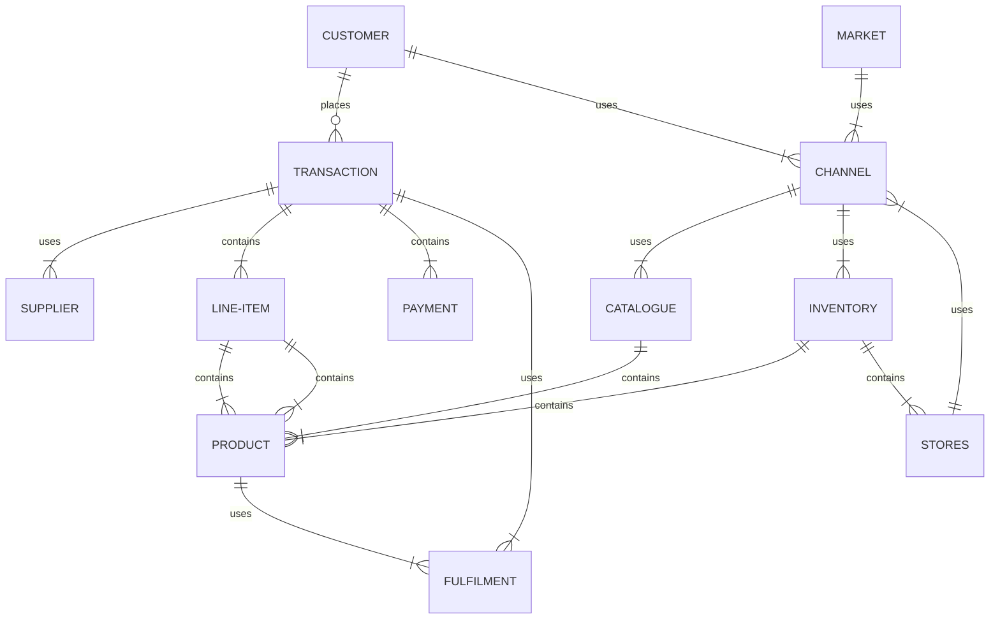

```mermaid
erDiagram
    TRANSACTION ||--|{ SUPPLIER : uses
    CUSTOMER ||--o{ TRANSACTION : places
    TRANSACTION ||--|{ LINE-ITEM : contains
    LINE-ITEM ||--|{ PRODUCT : contains
    INVENTORY ||--|{ PRODUCT : contains
    CUSTOMER ||--|{ CHANNEL : uses
    TRANSACTION ||--|{ PAYMENT : contains
    PRODUCT ||--|{ FULFILMENT : uses
    TRANSACTION ||--|{ FULFILMENT : uses
    MARKET ||--|{ CHANNEL : uses
    STORES ||--|{ CHANNEL : uses
    CHANNEL ||--|{ CATALOGUE : uses
    CHANNEL ||--|{ INVENTORY : uses
    INVENTORY ||--|{ STORES : contains
    CATALOGUE ||--|{ PRODUCT : contains
    LINE-ITEM ||--|{ PRODUCT : contains
```
